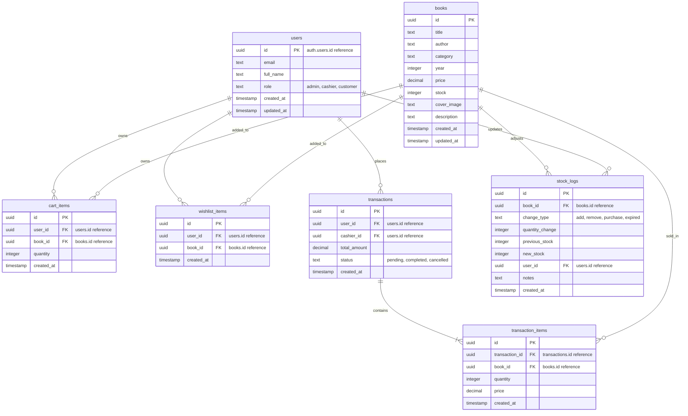

# Product Requirement Document (PRD): SiPustaka Bookstore Management System

**Document Version:** 1.0.0  
**Status:** Approved  
**Target Release:** Q3 2026  

---

## 1. Executive Summary
SiPustaka is a comprehensive Bookstore Management System designed to bridge the gap between offline cashier management, online customer catalog browsing, and administrative inventory monitoring. The platform serves as a single source of truth for bookstore inventory tracking, client transactions, customer shopping carts, and financial revenue insights.

---

## 2. Product Objectives
* **Streamline Operations:** Provide a fast, easy-to-use interface for bookstore cashiers and administrators to update stock logs and process orders.
* **Enhance Customer Experience:** Allow customers to browse books by category, search with instant suggestions, and manage a personalized shopping cart/wishlist.
* **Ensure Security & Compliance:** Enforce Role-Based Access Control (RBAC) via Supabase Row-Level Security (RLS) to protect transactional records and customer information.
* **Modern Deployment Flexibility:** Enable quick setups using Docker containers for development and Nginx for production, allowing the project to scale.

---

## 3. User Personas & Roles

The system is split into three primary roles, each with unique dashboard experiences:

| Persona | Description | Key Goals | Primary Interface |
| :--- | :--- | :--- | :--- |
| **Customer** | General reader or buyer | Browse catalog, search books, manage cart/wishlist, and checkout. | Customer Dashboard |
| **Cashier** | Store staff operating register | Look up inventory, create checkout transactions for walk-in/online buyers. | Cashier Dashboard |
| **Admin** | Bookstore manager / owner | Manage catalog (add/edit/delete books), track financials, view user roles. | Admin Dashboard |

---

## 4. Functional Requirements

### 4.1 Authentication & Profile Sync
* **User Signup:** Users can sign up with Full Name, Email, and Password. Upon signup, a PostgreSQL database trigger (`handle_new_user`) automatically inserts their details into the public `users` table with a default role of `'customer'`.
* **User Login:** Secure password-based authentication via Supabase Auth.
* **Session Persistence:** Persistent login states across page refreshes.

### 4.2 Customer Module
* **Interactive Book Catalog:** Browse all books dynamically.
* **Advanced Search & Filtering:**
  * Real-time search by Title, Author, and Category.
  * Instant dropdown preview search.
  * Sorting options: Alphabetical, Price (Low-High / High-Low), and Publication Year (Newest First).
* **Cart Management:** Add items to cart, increment/decrement quantities, view live subtotals, and remove items.
* **Wishlist Management:** Save books to a wishlist for later review.
* **Checkout:** Finalize transaction, verify stock availability, deduct stock automatically, and record invoice logs.

### 4.3 Cashier Module
* **Manual Checkout (Walk-in):** Process checkout transactions on behalf of customers in-store.
* *Note: The full interactive Cashier Dashboard UI is mapped in router and earmarked for the next iteration (Phase 2).*

### 4.4 Admin Module
* **Financial Analytics:** Displays total books, total users, completed transactions, and total revenue using visual graphs (Recharts).
* **Inventory Management:** CRUD operations on books (add new titles, edit prices/stock levels, upload cover images, delete items).
* **Stock Log Auditor:** Auto-logs quantity modifications (`add`, `remove`, `purchase`, `expired`) with previous and new stock levels, timestamped with the administrator's ID.
* **User Role Administration:** View all users, emails, signup dates, and roles.

### 4.5 Global Features
* **Light / Dark Mode:** Toggle UI themes dynamically with local storage persistence.
* **Multi-Language (Localization):** Switch seamlessly between English and Bahasa Indonesia.

---

## 5. Technical Architecture & Database Schema

### 5.1 Technology Stack
* **Frontend:** React.js, Vite, TypeScript, Tailwind CSS, Lucide Icons, Recharts.
* **Backend BaaS:** Supabase (Auth, RLS, Edge Functions, Postgres).
* **Deployment & Containerization:** Docker, Docker Compose, Nginx.

### 5.2 Database Entity-Relationship Model (ERD)

---

## 6. Security & Row-Level Security (RLS) Rules
To maintain data privacy, RLS is enabled on all tables in Supabase:
* **`users` Table:** Customers can read and update only their own profile. Admins can read and update all users.
* **`books` Table:** Anyone can read books. Only Admins can modify book records.
* **`cart_items` / `wishlist_items`:** Users can read and write only their own records.
* **`transactions` / `transaction_items`:** Users can view their own transactions. Cashiers and Admins can view and create all transactions.
* **`stock_logs`:** Only Cashiers and Admins can view or insert stock audit logs.

---

## 7. Future Roadmap & Enhancements
* **Phase 2 (Cashier UI):** Complete implementation of POS (Point of Sale) cashier terminals, barcode scanning integration, and receipt printing.
* **Phase 3 (Payment Gateways):** Integrate Midtrans / Stripe for direct digital credit card and e-wallet checkout flows.
* **Phase 4 (Reporting):** Introduce monthly CSV/PDF export capabilities for sales, margins, tax audits, and inventory forecasting.
